<div align="center">
  

  <h1>🚀 CodePilot</h1>
  <p><strong>AI-Powered Cloud-Based Code Editor — Build, Preview & Ship with an Intelligent Agent</strong></p>

  
  
  
  
  

  <p>
    <a href="#-application-overview">Overview</a> •
    <a href="#️-tech-stack">Tech Stack</a> •
    <a href="#-system-architecture">Architecture</a> •
    <a href="#-getting-started">Getting Started</a> •
    <a href="#-the-editor">The Editor</a> •
    <a href="#-ai-features">AI Features</a> •
    <a href="#-live-preview--webcontainers">Live Preview</a> •
    <a href="#-github-integration">GitHub</a> •
    <a href="#-payments--subscriptions">Payments</a>
  </p>
</div>

---

## 📊 Application Overview

**CodePilot** is a full-stack, AI-powered code editor built right in the browser — think Cursor, but as a SaaS. Powered by an intelligent AI agent built with Inngest AgentKit, CodePilot can create, edit, and reason about your entire codebase while you watch a live preview update in real time. It combines a professional IDE experience with an agentic AI layer, GitHub import/export, in-browser code execution via WebContainers, and a complete SaaS billing layer.

> Built as a complete production-ready playbook covering authentication, real-time database, AI agents, background jobs, error tracking, a full-featured code editor, live preview, and GitHub integration — all in one project.

### Key Features

* **AI Agent that edits files**: An Inngest-powered agent autonomously creates and modifies files across your project in response to natural language prompts
* **Ghost Text Suggestions**: Inline AI completions appear as you type — accept with Tab
* **Cmd+K Quick Edit**: Select any code block, press Cmd+K, and instruct the AI to transform it
* **Firecrawl URL Scraping**: Include live documentation from any URL directly into your AI prompts
* **Live Preview**: Run your project instantly in the browser using WebContainers — no server needed
* **Full IDE Layout**: Resizable split panes, tabbed file switcher, file tree with VSCode-style icons
* **CodeMirror 6 Editor**: Syntax highlighting, One Dark theme, and multi-language support
* **File Explorer**: Recursive tree component with collapsible folders and file selection state
* **Conversation System**: Persistent chat sidebar with message history and a "Thinking..." indicator
* **GitHub Import & Export**: Connect via OAuth, import any repo, and push back with Inngest background jobs
* **SaaS Billing**: Full subscription management powered by Clerk Billing
* **Error Tracking & AI Monitoring**: Sentry integration with background job failure capture and LLM call tracking

---

## ⚙️ Tech Stack

CodePilot is built with a carefully chosen set of modern technologies to deliver a fast, intelligent, and scalable browser-based IDE.

### Core Framework & Language

<table>
<tr>
<td width="50%">

**Next.js 15**

The React framework powering CodePilot's full-stack architecture. App Router, Server Components, and API routes give us SSR, optimized performance, and a clean separation between the IDE shell and the AI backend.

</td>
<td width="50%">

**TypeScript**

End-to-end type safety across the entire codebase — from Convex schema definitions to React components. TypeScript eliminates entire categories of bugs and makes the complex AI agent tooling system far easier to reason about.

</td>
</tr>
</table>

---

### Authentication & Billing

<table>
<tr>
<td colspan="2">

**Clerk**

Handles authentication, user management, and billing in one SDK. CodePilot uses Clerk for sign-in/sign-up flows, GitHub OAuth (enabling repository access), session middleware, and subscription management — with a complete billing portal built in.

</td>
</tr>
</table>

---

### Database & Real-Time Sync

<table>
<tr>
<td colspan="2">

**Convex DB**

A reactive, real-time database that pushes live updates to the client without polling. CodePilot stores all projects, files, folders, conversations, and messages in Convex — and because Convex subscriptions are reactive, the file explorer and chat sidebar stay in sync across tabs and devices instantly. The file/folder data model, CRUD operations, and Clerk authentication are all configured directly in Convex.

</td>
</tr>
</table>

---

### AI Agent & Background Jobs

<table>
<tr>
<td width="50%">

**Inngest AgentKit**

The brain of CodePilot's AI layer. Inngest AgentKit powers the AI agent that autonomously edits files, with durable background job execution, automatic retries, and step functions. The GitHub export job, long-running AI code generation, and file tree mounting all run reliably through Inngest even if the browser tab closes.

</td>
<td width="50%">

**AI SDK (Vercel)**

Used to implement ghost text completions and the Cmd+K quick edit modal. The AI SDK handles streaming responses, selection-based code editing, and the Firecrawl-enhanced prompt pipeline that injects live documentation into context.

</td>
</tr>
</table>

---

### Code Editor

<table>
<tr>
<td colspan="2">

**CodeMirror 6**

A best-in-class, modular code editor library. CodePilot's editor is built on CodeMirror 6 with the One Dark theme, syntax highlighting for major languages, a tabbed file switcher, and a custom ghost text extension that renders AI suggestions as greyed-out inline text — accepting with Tab, dismissing with Escape.

</td>
</tr>
</table>

---

### In-Browser Code Execution

<table>
<tr>
<td width="50%">

**WebContainers API**

Runs a full Node.js environment directly in the browser using WebAssembly. When you open the Preview tab, CodePilot mounts the entire file tree into a WebContainer, runs `npm install` and `npm run dev`, and streams the dev server output — no backend required.

</td>
<td width="50%">

**xterm.js**

A full-featured terminal emulator rendered in the browser, connected directly to the WebContainer process. CodePilot's terminal panel lets you run any command, watch install logs, and interact with the running dev server in real time.

</td>
</tr>
</table>

---

### URL Scraping

<table>
<tr>
<td colspan="2">

**Firecrawl**

Scrapes any URL and converts the content to clean Markdown, which is then injected into the AI agent's context. This means you can paste a link to any docs page — React, Tailwind, a third-party API — and the AI will use that live documentation when writing or editing your code.

</td>
</tr>
</table>

---

### Error Tracking & Monitoring

<table>
<tr>
<td width="50%">

**Sentry**

Full error tracking integrated with Next.js and Inngest. Any background job failure, unhandled exception, or AI call error is captured with a complete stack trace and breadcrumbs for instant debugging.

</td>
<td width="50%">

**Sentry AI Monitoring**

Tracks every LLM call made by the AI agent — prompts, responses, token usage, latency, and cost. Structured user context logs tie every AI interaction to a specific user and project for deep observability.

</td>
</tr>
</table>

---

### UI & Styling

<table>
<tr>
<td width="50%">

**Shadcn UI + Radix UI**

Accessible, unstyled-by-default components that form CodePilot's UI system — dialogs, dropdowns, tooltips, and more. All customized with TailwindCSS to match the dark IDE aesthetic.

</td>
<td width="50%">

**TailwindCSS + Zustand**

Tailwind handles all styling with utility classes. Zustand manages client-side editor state — currently open file, tab list, file content cache, and ghost text state — cleanly separated from server state in Convex.

</td>
</tr>
</table>

---

## 🏗️ System Architecture

```mermaid
flowchart TD
    USER(["👤 User / Browser"]):::startend

    subgraph FRONTEND["🖥️ Frontend — Next.js 15 App Router"]
        IDE["**IDE Shell**<br/>Resizable Split Panes<br/>Navbar · Tab Switcher"]:::process
        CM["**CodeMirror 6**<br/>One Dark · Syntax Highlight<br/>Ghost Text Extension"]:::process
        EXPLORER["**File Explorer**<br/>Recursive Tree<br/>VSCode Icons · Folder State"]:::process
        CHAT["**Chat Sidebar**<br/>Conversation History<br/>Thinking Indicator"]:::process
        PREVIEW["**Preview Panel**<br/>Iframe · WebContainer Output"]:::process
        TERMINAL["**xterm.js Terminal**<br/>WebContainer Process I/O"]:::process
    end

    subgraph STATE["⚡ State Management"]
        ZUSTAND["**Zustand**<br/>Editor State · Open Tabs<br/>File Content Cache · Ghost Text"]:::process
        CONVEX_CLIENT["**Convex Reactive Client**<br/>Live Subscriptions<br/>Optimistic Updates"]:::database
    end

    subgraph AUTH["🔐 Authentication & Billing"]
        CLERK["**Clerk**<br/>Sign In · Sign Up · GitHub OAuth<br/>Session Middleware · Billing Portal"]:::mlmodel
    end

    subgraph DB["🗄️ Convex DB"]
        PROJECTS["projects"]:::database
        FILES["files / folders"]:::database
        CONVERSATIONS["conversations"]:::database
        MESSAGES["messages"]:::database
    end

    subgraph AI_LAYER["🤖 AI Layer"]
        AGENT["**Inngest AgentKit**<br/>AI Agent · Tool Calls<br/>System Prompt · Durable Exec"]:::mlmodel
        GHOST["**Ghost Text API**<br/>Inline Completions<br/>Tab Acceptance"]:::mlmodel
        CMDK["**Cmd+K Edit API**<br/>Selection-Based Editing<br/>Streaming Response"]:::mlmodel
        FIRECRAWL["**Firecrawl**<br/>URL → Markdown<br/>Live Docs Injection"]:::env
    end

    subgraph INNGEST["⚙️ Inngest Background Jobs"]
        JOB_AGENT["**codeAgent function**<br/>File Create · File Edit<br/>Multi-step · Auto-retry"]:::process
        JOB_GH_EXPORT["**githubExport function**<br/>Repo Create · Tree Build<br/>Git Push · Status Tracking"]:::process
    end

    subgraph WEBCONTAINER["🐳 WebContainers (Browser)"]
        WC["**WebContainers API**<br/>Node.js in WASM<br/>File Tree Mount · npm install"]:::env
        DEV_SERVER["**Dev Server Process**<br/>npm run dev<br/>Port Forwarding"]:::env
    end

    subgraph GITHUB["🐙 GitHub API"]
        GH_OAUTH["**OAuth via Clerk**<br/>Repository Access Token"]:::mlmodel
        GH_API["**GitHub REST API**<br/>Repo Create · Contents API<br/>Binary File Support"]:::mlmodel
    end

    subgraph MONITORING["📊 Sentry Monitoring"]
        SENTRY_ERR["**Error Tracking**<br/>Stack Traces · Breadcrumbs<br/>Inngest Job Failures"]:::mlmodel
        SENTRY_AI["**AI Monitoring**<br/>LLM Calls · Token Usage<br/>Latency · Cost · User Context"]:::mlmodel
    end

    USER --> IDE
    IDE --> CM
    IDE --> EXPLORER
    IDE --> CHAT
    IDE --> PREVIEW
    IDE --> TERMINAL

    CM <--> ZUSTAND
    EXPLORER <--> ZUSTAND
    CHAT <--> CONVEX_CLIENT

    CONVEX_CLIENT <--> PROJECTS
    CONVEX_CLIENT <--> FILES
    CONVEX_CLIENT <--> CONVERSATIONS
    CONVEX_CLIENT <--> MESSAGES

    CLERK -->|"Auth Gate · User ID"| CONVEX_CLIENT
    CLERK -->|"GitHub Token"| GH_OAUTH

    CHAT -->|"Send Message"| JOB_AGENT
    JOB_AGENT --> AGENT
    AGENT -->|"createFile / editFile tools"| FILES
    AGENT -->|"scrapeUrl tool"| FIRECRAWL
    FIRECRAWL -->|"Enriched Prompt"| AGENT

    CM -->|"Keystroke Context"| GHOST
    CM -->|"Cmd+K Selection"| CMDK
    GHOST -->|"Inline Suggestion"| CM
    CMDK -->|"Edited Code"| CM

    EXPLORER -->|"Export to GitHub"| JOB_GH_EXPORT
    JOB_GH_EXPORT --> GH_API
    GH_OAUTH --> GH_API

    FILES -->|"Mount File Tree"| WC
    WC --> DEV_SERVER
    DEV_SERVER -->|"iframe src URL"| PREVIEW
    WC -->|"Process I/O"| TERMINAL

    AGENT -->|"Errors + LLM Calls"| SENTRY_AI
    JOB_AGENT -->|"Job Failures"| SENTRY_ERR
    JOB_GH_EXPORT -->|"Job Failures"| SENTRY_ERR

    classDef startend fill:#1a7a1a,stroke:#4caf50,stroke-width:2px,color:#ffffff,font-weight:bold
    classDef database fill:#7b2d8b,stroke:#ce93d8,stroke-width:2px,color:#ffffff,font-weight:bold
    classDef mlmodel fill:#c62828,stroke:#ef9a9a,stroke-width:2px,color:#ffffff,font-weight:bold
    classDef process fill:#1565c0,stroke:#90caf9,stroke-width:2px,color:#ffffff,font-weight:bold
    classDef env fill:#4527a0,stroke:#b39ddb,stroke-width:2px,color:#ffffff,font-weight:bold
```



---

## 🚀 Getting Started

### Prerequisites

Before running CodePilot locally, you'll need accounts and API keys for the following services:

- [Clerk](https://clerk.com) — Authentication & Billing
- [Convex](https://convex.dev) — Database
- [Inngest](https://inngest.com) — Background Jobs & Agent
- [Firecrawl](https://firecrawl.dev) — URL Scraping
- [Sentry](https://sentry.io) — Error Tracking
- An AI provider key (OpenAI / Anthropic / Google)

### Installation

```bash
# 1. Clone the repository
git clone https://github.com/YOUR_USERNAME/codepilot.git
cd codepilot

# 2. Install dependencies
npm install

# 3. Copy environment variables
cp .env.example .env.local
```

### Environment Variables

```env
# Clerk
NEXT_PUBLIC_CLERK_PUBLISHABLE_KEY=
CLERK_SECRET_KEY=
NEXT_PUBLIC_CLERK_SIGN_IN_URL=/sign-in
NEXT_PUBLIC_CLERK_SIGN_UP_URL=/sign-up

# Convex
NEXT_PUBLIC_CONVEX_URL=
CONVEX_DEPLOY_KEY=

# Inngest
INNGEST_EVENT_KEY=
INNGEST_SIGNING_KEY=

# AI Provider
OPENAI_API_KEY=
# or ANTHROPIC_API_KEY= / GOOGLE_GENERATIVE_AI_API_KEY=

# Firecrawl
FIRECRAWL_API_KEY=

# Sentry
NEXT_PUBLIC_SENTRY_DSN=
SENTRY_AUTH_TOKEN=
```

### Running Locally

```bash
# Start the Convex dev server (in a separate terminal)
npx convex dev

# Start the Inngest dev server (in a separate terminal)
npx inngest-cli@latest dev

# Start the Next.js dev server
npm run dev
```

Open [http://localhost:3000](http://localhost:3000) to see CodePilot running.

---

## 🖥️ The Editor

<div align="center">
  <!-- Replace with your actual screenshot -->
  
</div>

The CodePilot IDE is a fully browser-based development environment with a layout and feature set modelled after desktop editors like VSCode and Cursor.

### IDE Layout

The editor shell is built with resizable split panes — the AI chat sidebar on the left, the code editor and file explorer in the center, and the preview/terminal panel on the right. Code/Preview tab switching lets you toggle between editing and running your app without losing context.

<table>
<tr>
<td width="50%">


</td>
<td width="50%">

#### File Explorer

The file explorer renders a recursive tree component for any project structure. Folders are collapsible, files display VSCode-style language icons via `vscode-icons-js`, and clicking a file opens it in a new editor tab. All file and folder state is persisted in Convex with a clean hierarchical data model.

</td>
</tr>
</table>

<table>
<tr>
<td width="50%">

#### CodeMirror 6 Editor

The code editor is powered by CodeMirror 6 — the best-in-class modular editor library. Features include syntax highlighting for all major languages, the One Dark theme, a tabbed file switcher for working across multiple files simultaneously, and a custom ghost text extension that renders AI completions inline.

</td>
<td width="50%">


</td>
</tr>
</table>

---

## 🤖 AI Features

<div align="center">
  
</div>

CodePilot's AI layer is built in layers — from passive inline suggestions to a fully autonomous agent that can navigate, create, and rewrite your entire project.

### Ghost Text Suggestions

<table>
<tr>
<td width="50%">


</td>
<td width="50%">

As you type, CodePilot sends the current file context to the AI and renders the completion as greyed-out ghost text inline in the editor — exactly like GitHub Copilot. Press **Tab** to accept the suggestion, or keep typing to dismiss it. The ghost text extension is implemented as a custom CodeMirror 6 decoration, keeping it tightly integrated with the editor state.

</td>
</tr>
</table>

### Cmd+K Quick Edit

<table>
<tr>
<td width="50%">

Select any block of code, press **Cmd+K**, and a modal appears. Describe the change you want — "add error handling", "convert to TypeScript", "add a gradient using Tailwind" — and the AI rewrites the selection and streams the result back into the editor. The quick edit modal uses the same AI SDK pipeline as the agent, with the selected code passed as context.

</td>
<td width="50%">


</td>
</tr>
</table>

### AI Agent (Inngest AgentKit)

<div align="center">
  
</div>

The most powerful feature of CodePilot is the AI agent powered by **Inngest AgentKit**. When you send a message in the chat sidebar, it triggers a durable Inngest background job that runs an agent loop with a full tool system:

- **`createFile`** — Creates a new file in the project with generated content
- **`updateFile`** — Edits an existing file based on the instruction
- **`deleteFile`** — Removes files no longer needed
- **`scrapeUrl`** — Calls Firecrawl to fetch any URL as Markdown and inject it into context

The agent reasons over the entire conversation history, the current file tree, and any scraped documentation before deciding which tools to call. Because it runs on Inngest, it survives page refreshes, handles retries automatically, and streams status updates back to the chat sidebar via Convex in real time.

### Firecrawl URL Scraping

<div align="center">
  
</div>

Include any URL in your message — a documentation page, a GitHub README, an API reference — and CodePilot automatically detects it, scrapes it with Firecrawl, converts it to clean Markdown, and injects it into the agent's context window. This means the AI always has access to the latest, most accurate documentation when writing code for any library or API.

---

## 🌐 Live Preview & WebContainers

<div align="center">
  
</div>

CodePilot runs your project **entirely in the browser** using the WebContainers API. When you switch to the Preview tab, CodePilot mounts the current file tree into a WebContainer instance, runs `npm install` followed by `npm run dev`, and forwards the dev server's port to an iframe — all without any backend server.

### How It Works

The file tree mounting system reads all files and folders from Convex and builds a WebContainers-compatible file system object that mirrors your project structure, including binary file support. The terminal panel uses **xterm.js** to render a real terminal connected to the WebContainer process, so you can see install logs, run custom commands, and interact with the dev server directly.

<table>
<tr>
<td width="50%">


</td>
<td width="50%">

#### Built-in Terminal

The integrated terminal is a full xterm.js instance connected to the WebContainer's shell process. Run any command, watch your `npm install` output, restart the dev server, or execute custom scripts — all without leaving the browser.

</td>
</tr>
</table>

Preview settings let you configure the start command and port, so you can work with any framework — React, Vue, Svelte, vanilla JS — not just the defaults.

---

## 🐙 GitHub Integration

<div align="center">
  
</div>

CodePilot has deep, bidirectional GitHub integration — connect your account, import any repository to work on it inside the IDE, and push your project back to GitHub with a single click.

### GitHub Import

Connecting your GitHub account via Clerk OAuth grants CodePilot a repository access token. The import system fetches the repository tree from the GitHub Contents API, downloads every file (with binary file support for images, fonts, etc.), and writes the complete project into Convex — ready to open in the IDE instantly.

### GitHub Export

<table>
<tr>
<td width="50%">

Exporting your project back to GitHub runs as an **Inngest background job**, so it works reliably even for large projects. The export job creates a new repository (or pushes to an existing one), builds the complete file tree from Convex, handles binary encoding, and uses the GitHub REST API to commit everything. Real-time status tracking via Convex keeps the UI updated as the export progresses.

</td>
<td width="50%">


</td>
</tr>
</table>

---

## 💬 Conversation System

<div align="center">
  
</div>

Every project has a persistent conversation history stored in Convex. The chat sidebar distinguishes between user and assistant messages, displays a **"Thinking..."** indicator while the agent is running, and supports message cancellation if you want to interrupt a long-running generation.

A **conversation history dialog** lets you browse and resume past conversations for any project — so you always have the full context of every AI interaction that produced the current state of your code.

---

## 💳 Payments & Subscriptions

CodePilot is a complete SaaS application with subscription management powered by **Clerk Billing**. Users get access to the full feature set on a subscription plan, with the billing portal, subscription status, and payment management all handled natively through Clerk's billing infrastructure.

<table>
<tr>
<td width="50%">


</td>
<td width="50%">

#### Subscription Management

- **Clerk Billing Portal**: Users manage their subscription, update payment methods, and view invoices directly from their account settings
- **Subscription Gating**: IDE features are gated behind an active subscription, with clear upgrade prompts for free users
- **Webhook Handling**: Clerk billing webhooks keep subscription state in sync with Convex in real time

</td>
</tr>
</table>

---

## 📊 Error Tracking & Monitoring

<div align="center">
  
</div>

Sentry is configured with the Next.js wizard for automatic error capture across the app. Background job failures from Inngest are caught and reported with full context — which user triggered the job, which project was involved, and the complete stack trace.

**AI Monitoring** tracks every call made by the agent — prompt content, model response, token counts, latency, and cost — tied to structured user context logs for debugging prompt engineering issues and optimizing model performance.

---

## 📖 Build Chapters

CodePilot was built chapter by chapter as a complete production playbook. Here's what each chapter covers:

| Chapter | Topic | Key Concepts |
|---------|-------|-------------|
| 1 | **Foundation** | Next.js 15, TypeScript, project setup |
| 2 | **Authentication** | Clerk SDK, sign-in/up flows, middleware |
| 3 | **Database Setup** | Convex schema, CRUD, Clerk + Convex integration |
| 4 | **Background Jobs** | Inngest SDK, blocking vs non-blocking, AI SDK setup |
| 5 | **Firecrawl AI** | Web scraping, URL extraction, prompt enhancement |
| 6 | **Error Tracking** | Sentry + Next.js, Inngest failure capture, AI monitoring |
| 7 | **Payments** | Clerk Billing, subscription gating, webhook handling |
| 8 | **IDE Layout** | Split panes, routing, navbar, Code/Preview tabs |
| 9 | **File Explorer** | Convex data model, recursive tree, vscode-icons-js |
| 10 | **Code Editor & State** | CodeMirror 6, One Dark, Zustand, tabbed file switcher |
| 11 | **AI Features** | Ghost text, Tab acceptance, Cmd+K modal, Firecrawl scraping |
| 12 | **Conversation System** | Convex messages, chat sidebar, history dialog, cancellation |
| 13 | **AI Agent & Tools** | Inngest AgentKit, system prompts, complete tool system |
| 14 | **WebContainers, Terminal & Preview** | WebContainers API, file mounting, xterm.js, CORS config |
| 15 | **GitHub Import & Export** | OAuth, binary files, Inngest export job, real-time status |

---

## 📧 Contact

**[Your Name]** — [LinkedIn](#) • [Twitter/X](#)

Project Link: [https://codepilot.vercel.app](https://codepilot.vercel.app)

GitHub Repository: [https://github.com/YOUR_USERNAME/codepilot](https://github.com/YOUR_USERNAME/codepilot)

---

<div align="center">
  <p>Made with ❤️ for developers who want to build faster with AI</p>
  <p>⭐ Star this repo if you find it helpful!</p>
</div>